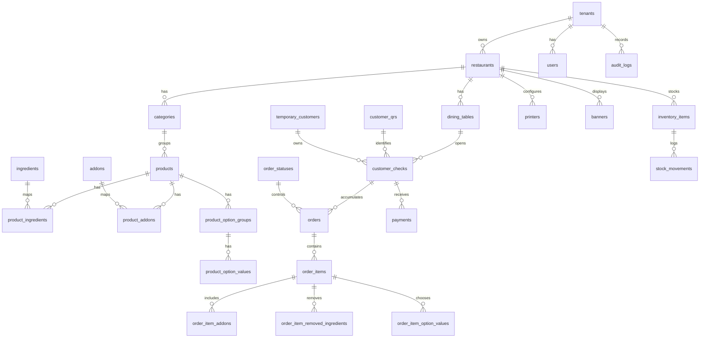

# Banco de dados

Arquivos:

- `database/schema.sql`: criacao das tabelas, chaves, indices e relacionamentos.
- `database/seeds.sql`: dados iniciais de desenvolvimento.

## Diagrama logico resumido



## Tabelas principais

| Tabela | Finalidade |
| --- | --- |
| `tenants` | Conta SaaS, plano e status do cliente. |
| `restaurants` | Dados do restaurante, taxa de servico, capa, logo e fiscal. |
| `themes` | Tema visual por restaurante. |
| `users` | Usuarios com hash de senha. |
| `roles`, `permissions`, `role_permissions`, `user_roles` | RBAC por funcao. |
| `dining_tables` | Mesas, QR token e status operacional. |
| `table_devices` | Tablet, navegador, APK ou desktop vinculado a mesa. |
| `customer_qrs` | QR Codes fisicos reutilizaveis da pessoa/comanda, com codigo aleatorio como `PAX-8F3KQ2`. |
| `temporary_customers` | Cliente temporario identificado por QR/comanda. |
| `customer_checks` | Sessao aberta/fechada da comanda individual em uma mesa. Guarda taxa de servico habilitada/desabilitada e desconto aplicado. |
| `categories` | Categorias do cardapio com ordem e imagem. |
| `products` | Produtos com preco, preparo, destaque, disponibilidade e setor. |
| `ingredients`, `product_ingredients` | Ingredientes removiveis e composicao do produto. |
| `addons`, `product_addons` | Adicionais pagos por produto. |
| `product_option_groups`, `product_option_values` | Opcoes obrigatorias/opcionais como ponto, tamanho e borda. |
| `combos`, `combo_items` | Estrutura para combos. |
| `order_statuses` | Status permitidos do pedido. |
| `orders` | Pedido principal vinculado a mesa e comanda. |
| `order_items` | Itens do pedido com snapshots de nome/preco. |
| `order_item_addons` | Adicionais escolhidos no item. |
| `order_item_removed_ingredients` | Ingredientes removidos pelo cliente. |
| `order_item_option_values` | Variacoes escolhidas. |
| `order_status_history` | Historico de transicoes do pedido. |
| `cash_registers`, `cash_sessions` | Caixa fisico e abertura/fechamento de turno. |
| `payments`, `payment_webhooks` | Pagamentos, PIX/cartao/gateways e conciliacao. |
| `printers` | Impressoras por setor, largura de bobina e template de ticket. Padrao inicial: bobina termica 80mm. |
| `banners` | Banners do cardapio. |
| `restaurant_settings` | Configuracoes flexiveis em JSON. |
| `inventory_items`, `stock_movements` | Estoque e baixa/auditoria de movimentacao. |
| `offline_sync_queue` | Sincronizacao de eventos criados offline. |
| `audit_logs` | Registro de acoes sensiveis. |

## Indices importantes

- `idx_orders_live`: busca rapida de pedidos por tenant/restaurante/status/data.
- `idx_products_menu`: montagem do cardapio por categoria e disponibilidade.
- `idx_payments_check`: consulta de pagamentos da comanda.
- `idx_customer_qrs_status`: administracao de lotes de QRs disponiveis/em uso/inativos.
- `idx_checks_code_status`: resolucao rapida do QR individual para a comanda aberta.
- `idx_audit_entity`: auditoria por entidade.
- `idx_offline_pending`: processamento da fila offline.
- `FULLTEXT ft_products_search`: busca textual de produto.

## Isolamento de dados

Toda query operacional deve filtrar por:

```sql
WHERE tenant_id = ? AND restaurant_id = ?
```

Excecoes sao tabelas globais como `permissions` e `order_statuses`.

## Variaveis de ambiente

Use `.env`:

```bash
DB_HOST=127.0.0.1
DB_PORT=3306
DB_NAME=restaurant_qr
DB_USER=restaurant_user
DB_PASSWORD=change_me
```

Nunca versionar `.env` com credenciais reais.
