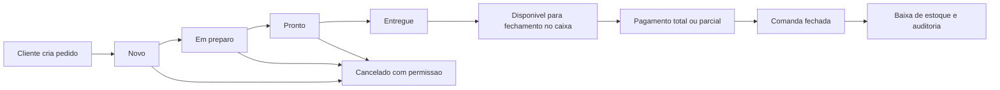

# Fluxos operacionais

## Fluxo obrigatorio do pedido

Regras:

- O pedido sempre nasce como `new`.
- A cozinha muda para `preparing`, depois `ready`, depois `delivered`.
- O caixa so fecha a comanda quando todos os pedidos estao `delivered` ou `cancelled`.
- Cancelamento exige permissao e motivo.
- Toda mudanca gera auditoria.

## Cliente QR

1. Cliente abre o QR da mesa ou usa o tablet fixo da mesa.
2. API resolve `tenant_id`, restaurante e mesa pelo token/codigo da mesa.
3. Cliente visualiza tema, banners, categorias e produtos ativos sem acesso a cozinha ou caixa.
4. Cliente escolhe produto, adicionais, remocoes, opcoes e observacoes.
5. Ao finalizar, o cliente escaneia ou digita o QR individual fisico da comanda, como `PAX-8F3KQ2`.
6. API valida o QR individual em `POST /public/checks/resolve` e cria ou reutiliza a comanda aberta daquela pessoa naquela mesa.
7. Pedido e vinculado a `table_id` para operacao e ao `check_id` da comanda individual para acumulador financeiro.
8. Cozinha recebe evento `order:new`.

## Cozinha

1. Tela carrega pedidos em aberto.
2. WebSocket recebe novos pedidos.
3. Pedido novo gera alerta visual e pode disparar impressao automatica.
4. Setor filtra itens de cozinha, bar ou sobremesa.
5. Pedidos atrasados sao destacados pelo tempo decorrido.
6. Status segue a regra de transicao compartilhada.

## Caixa

1. Caixa escaneia ou digita QR/codigo da comanda.
2. API retorna mesa, cliente, itens, taxa de servico, total, pago e saldo.
3. Caixa pode remover a taxa do garcom e aplicar desconto autorizado antes do pagamento.
4. Caixa registra pagamento parcial ou total.
5. Fechamento bloqueia comandas com pedidos pendentes.
6. Ao fechar, mesa volta para disponivel e a auditoria registra a acao.

## Impressao

1. Pedido novo consulta impressoras ativas por setor.
2. Ticket usa template configurado.
3. A primeira versao pode imprimir pelo navegador.
4. Em Windows, o caminho recomendado e um servico local para impressora termica.
5. ESC/POS deve ser implementado como driver isolado, sem acoplar a regra de pedido.
